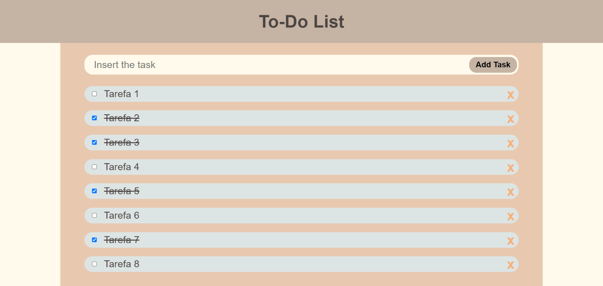
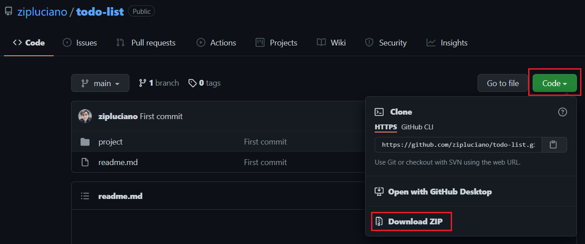
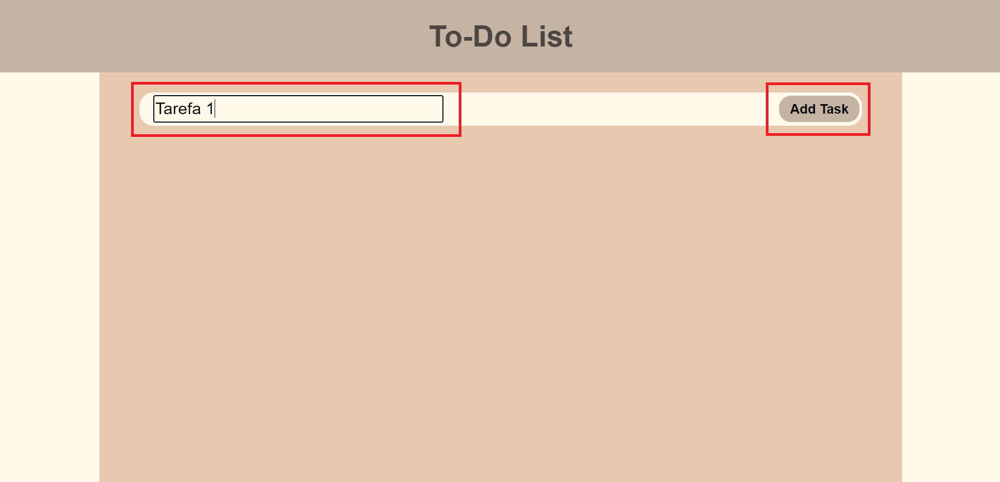
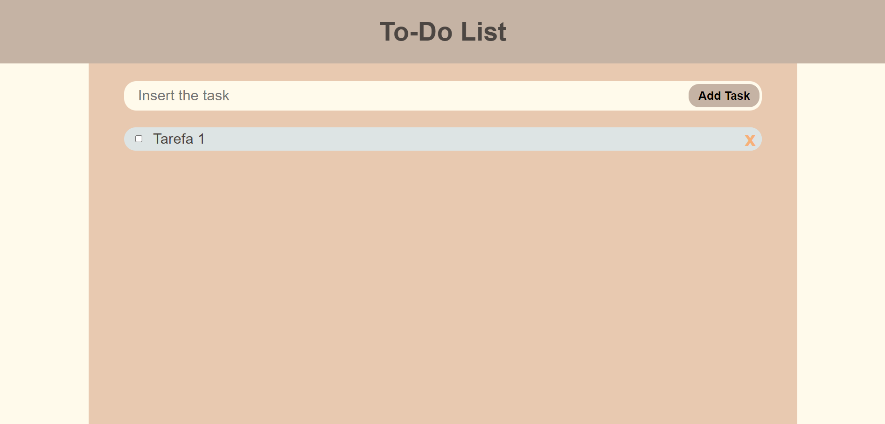
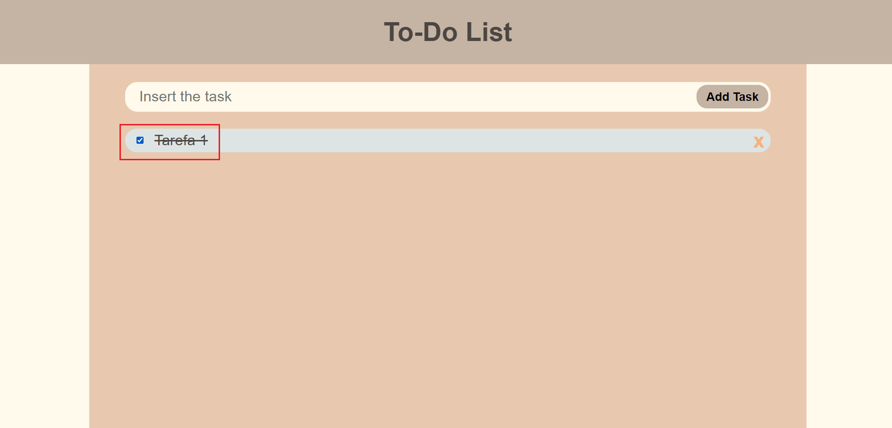
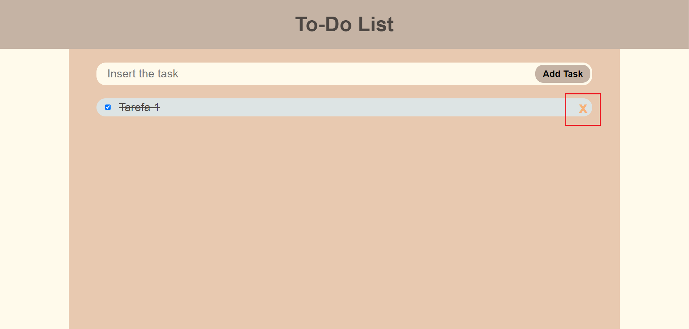

# To-Do List

Esse projeto foi desenvolvido com o objetivo de praticar a manipulação do DOM, com HTML, CSS e JavaScript, através de formulários e armazenamento em LocalStorage. Para utilizá-lo basta seguir os passos em [Como usar](#como-usar).

 

## Nota

Antes das instruções para utilização, é necessário verificar se você possui Git instalado em sua máquina e executar o comando `git clone https://github.com/zipluciano/todo-list`, ou baixar este repositório compactado, conforme a imagem abaixo. 

### Como usar

- Abra o arquivo `index.html` no seguinte caminho `./project/index.html`

- Para adicionar uma tarefa digite-a no campo de inserção

  
  

- Para marcar uma tarefa como finalizada, clique sobre o nome da tarefa ou no checkbox ao lado

  

- Para remover a tarefa, clique no X 

  

# License

MIT License (MIT) 2021 - [LICENSE](./LICENSE)
